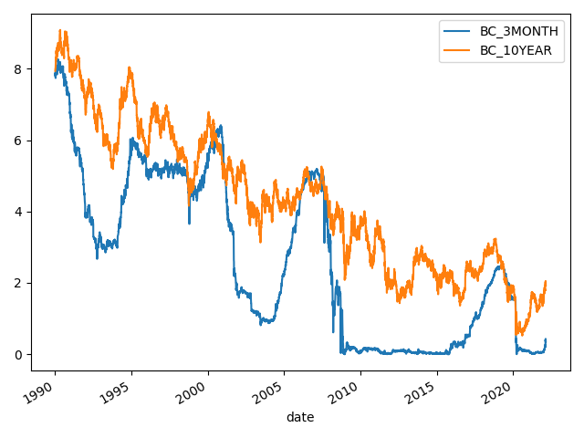

# US Treasuries Yield Curve Data

## Data source

Data source page: ["Daily Treasury Par Yield Curve Rates"](https://home.treasury.gov/resource-center/data-chart-center/interest-rates/TextView?type=daily_treasury_yield_curve&field_tdr_date_value=2022) 

## Large dataset

CSV file (1990-present):

 - [daily yields](https://raw.githubusercontent.com/epogrebnyak/data-ust/master/ust.csv)
 
## How to use

Build a local file (`rates.csv`) with US Treasuries yields by maturity: 

```python
import os
import pandas as pd
from ust import save_rates, force_save, read_rates

# save UST yield rates to local folder for selected years
for year in [2020, 2021, 2022]:
    save(year, folder="./xml")

# force update last year (overwrites existing file)
force_save(2022, folder="./xml")

# read as pandas dataframe
df = read_rates(start_year=2020, end_year=2022, folder="./xml")

# save as single CSV file
df.to_csv("rates.csv")

# read back later
df = pd.read_csv("ust.csv", parse_dates=["date"]).set_index("date")

"""
            BC_1MONTH  BC_3MONTH  BC_6MONTH  ...  BC_20YEAR  BC_30YEAR  BC_30YEARDISPLAY
date                                         ...                                        
2020-01-02       1.53       1.54       1.57      1.56  ...       1.88       2.19       2.33              2.33
2020-01-03       1.52       1.52       1.55      1.55  ...       1.80       2.11       2.26              2.26
2020-01-06       1.54       1.56       1.56      1.54  ...       1.81       2.13       2.28              2.28
2020-01-07       1.52       1.54       1.56      1.53  ...       1.83       2.16       2.31              2.31
2020-01-08       1.50       1.54       1.56      1.55  ...       1.87       2.21       2.35              2.35
...               ...        ...        ...       ...  ...        ...        ...        ...               ...
2022-03-03       0.19       0.38       0.69      1.08  ...       1.86       2.32       2.24              2.24
2022-03-04       0.15       0.34       0.69      1.05  ...       1.74       2.23       2.16              2.16
2022-03-07       0.17       0.38       0.75      1.07  ...       1.78       2.29       2.19              2.19
2022-03-08       0.16       0.36       0.72      1.12  ...       1.86       2.34       2.24              2.24
2022-03-09       0.18       0.38       0.75      1.15  ...       1.94       2.38       2.29              2.29
              2.29
"""
```

## Sample image



## Notes

- `start_year` can go back to 1990, but even longer dataset is avilable at FRED
- API [changed](https://home.treasury.gov/developer-notice-xml-changes) in February 2022 


